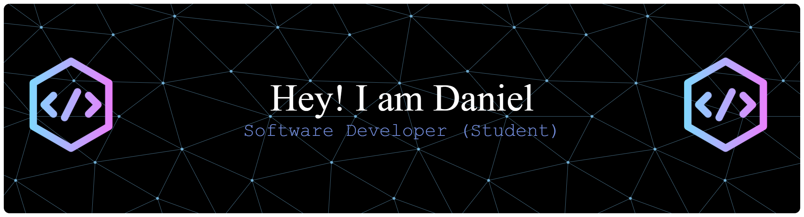

# 👋 About Me

🎓 I'm a student at the **Faculty of Management Science and Informatics**, University of Žilina.  
🧑‍🎓 **Bachelor's graduate**, currently studying Applied Informatics at the Master's level.
🌐 I'm passionate about **web development** and always eager to learn new technologies.

## 🔗 Connect with me
💼 LinkedIn: **[Daniel Zuzčák](https://www.linkedin.com/in/daniel-zuz%C4%8D%C3%A1k-66a2b9374/)**  
📧 Email: **danzuz009@yahoo.com**  

---

## 🚀 Technologies I Work With

  

---

## 📊 GitHub Stats Last Year

 
<!--   
 -->

---

## 💻 LeetCode Progress

---

> _"Every professional was once a beginner."_
<!--
**firkraagg/firkraagg** is a ✨ _special_ ✨ repository because its `README.md` (this file) appears on your GitHub profile.

Here are some ideas to get you started:

- 🔭 I’m currently working on ...
- 🌱 I’m currently learning ...
- 👯 I’m looking to collaborate on ...
- 🤔 I’m looking for help with ...
- 💬 Ask me about ...
- 📫 How to reach me: ...
- 😄 Pronouns: ...
- ⚡ Fun fact: ...
-->
